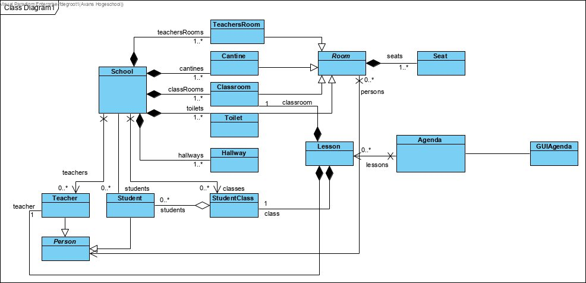

# Portfolio
## **Lesweek 2**
### *Reflectie proces*
Deze lesweek was er nog niet heel veel werk dat gedaan moest worden. De opdrachten werden dus voornamelijk in paren gedaan. Ook was het werk nu nog niet heel moeilijk of nieuw. De opdrachten waren dingen die we al geleerd hadden in de vorige perioden. Aangezien het werk niet heel moeilijk was waren we dus ook al snel klaar met het maken van deze opdrachten.
Mijn bijdrage aan de proftaak in week 2, bestond voornamelijk uit het uitschrijven van het klassendiagram die gemaakt is in week 1. Daarbij heb ik een aantal aanpassingen en naam aanpassingen gemaakt in het voorgemaakte diagram. Uiteraard heb ik dit eerst voorgestelt aan de andere projectleden, voordat ik met deze aanpassingen aan de slag ging. De reden voor deze aanpassingen was vooral omdat het klassen diagram gemaakt in lesweek 1, meer een idee was dan echt een vastgesteld plan.
Sjoerd kwam in week 1 met het voorstel om zijn framework te gaan gebruiken we vonden bijna allemaal dit een prima idee op 2 leden na. Echt een keuze hebben we nog niet gemaakt maar ben ik er wel van overtuigd dat we het waarschijnlijk gaan gebruiken. Voor de rest ging het werken zelf goed, we liepen niet tegen problemen aan en konden de dag snel afronden.

### *Reflectie vakinhoudelijk*
Het is de eerste lesweek van de proftaak waar er echt code geschreven moet worden. De eerste lesweek bestond voornamelijk op het opstellen van het plan van aanpak en jezelf orienteren op de opdracht die de volgende weken gemaakt moet worden. We hebben dus ook in week 1 een klassendiagram, die breedt het idee geeft van wat er gemaakt moet worden gemaakt.

Ik had de taak gekregen om dus deze klassendiagram te brengen naar het project. Ook moest ik meteen de variabelen erbij gaan schrijven en dus gaan denken over wat wat nodig heeft. Het was nog niet heel belangrijk of dat alles precies had wat de klasse nodig had. Aangezien we de data toch wouden gaan scheiden van de simulatie klassen. Dus heb ik bij elke klasse wat variabelen erbij gedaan die heel logisch zijn. Bijvoorbeeld: bij Person een naam en een leeftijd, bij Room een kamernummer, etc. Uiteraard heb ik bij deze klassen dan ook getters en setters erbij geschreven. Ook wat zoek en verwijder functies voor klassen die een ArrayList bezitten. De reden waarom we niet meteen de klassen hebben geschreven volgens ons idee, is omdat ik nog niet veel wist over de nieuwe stof en dus een soort basis klassen systeem had gemaakt. De rest was bezig met het maken van een begin van de agenda. Aangezien we net 1 week 2DGraphics hadden gedaan moesten veel mensen heirna kijken om al stof te begrijpen die we nogniet hadden gehad. Later nadat het begin van de agenda was afgerond en er iets getekent kon worden, heb ik de code goed doorgekeken om het te begrijpen. Had zag er nog wat rommelig uit dus dit moest later nog opgeruimt worden.

## **Lesweek 3**
### *Reflectie proces*
Deze lesweek hebben we les gehad in het werken met ObjectIO. Het plan was dan om deze week ons data systeem op te zetten plus de bijbehorende DataWriter en DataReader. Ook moest de agenda verbeterd worden en moest er gezocht worden naar spritesheet plus het bouwen van een map. Deze taken hebben we allemaal kunnen verdelen. Ons idee was tijdens het werk elkaar te informeren over bepaalde keuzes dei gemaakt moesten worden. Aangezien we nog niet wisten hoe alles zou werken vonden we dit een goede manier van werken. Zo konden we meteen aan de slag en hulp vragen wanneer dat nodig was. De werksfeer was goed alleen kwam de discussie van het gebruik van het framework weer naar boven. Één lid was nog niet helemaal eens over het gebruiken van dit framework. Hij zag namelijk niet het voordeel er van in en vond het een beter idee om vanaf niets te beginnen en dit framework dus links laten liggen. We hebben verder hem niet kunnen "overhalen" en in principe nog geen keuze gemaakt. 

### *Reflectie vakinhoudelijk*
Deze lesweek hiervoor hebben goede uitleg gekregen over ObjectIO. Hierdoor hebben wij dus onze data systeem kunnen toepassen. Ik ging aan de slag met het opzetten van de data klassen. Zo is er een "hoofd" klasse waar al onze data uiteindelijk inkomt. Dit maakt het makkelijk om zo data op te slaan. Want dan hoef je maar naar één klasse te kijken, daar alles uithalen en dit allemaal opschrijven op één save file doormiddel van ObjectIO. Sjoerd had het idee om een "enum singleton" te maken voor de SavedData klasse. Ik had hier persoonlijk nog nooit van gehoord, dit zit ook niet tussen de lesstof die we hebben gehad. Ik had het opgezocht en het zag er makkelijk uit en het kwam met veel voordelen voor wat wij wouden doen.

public enum SavedData {

    INSTANCE;

    private ArrayList<StudentData> studentData = new ArrayList<StudentData>();
    private ArrayList<TeacherData> teacherData = new ArrayList<TeacherData>();
    private ArrayList<LessonData> lessonData = new ArrayList<LessonData>();
    private ArrayList<GroupData> groupData = new ArrayList<GroupData>();

    // Getters and Setters
    public ArrayList<StudentData> getStudentData() {
        return studentData;
    }
    public void setStudentData(ArrayList<StudentData> studentData) {
        this.studentData = studentData;
    }

    public ArrayList<TeacherData> getTeacherData() {
        return teacherData;
    }
    public void setTeacherData(ArrayList<TeacherData> teacherData) {
        this.teacherData = teacherData;
    }

    public ArrayList<LessonData> getLessonData() {
        return lessonData;
    }
    public void setLessonData(ArrayList<LessonData> lessonData) {
        this.lessonData = lessonData;
    }

    public ArrayList<GroupData> getGroupData() {
        return groupData;
    }
    public void setGroupData(ArrayList<GroupData> groupData) {
        this.groupData = groupData;
    }
}

Dit is hoe de code van de SavedData klasse eruit zit. De klasse is dus gevuld met ArrayLists die de aparte data van de student, teacher, lesson en group bijhouden. Deze zijn dan weer gevult met variabelen zoals: name, age, Gender, etc. 

Door zo een enum te maken met één "optie" erin kan je deze makkelijk overal aanroepen en krijg je toegang tot deze ArrayLists. Het grootste voordeel hiervan is dat hier maar één instantie van kan zijn. Zo kan er nooit een tweede SavedData enum gemaakt worden. En creeëren wij dus één plek waar alle data samen komt. Om deze data te bereiken kan je dus overal SavedData.INSTANCE schrijven en krijg je toegang tot all deze getters en setters van de data.
